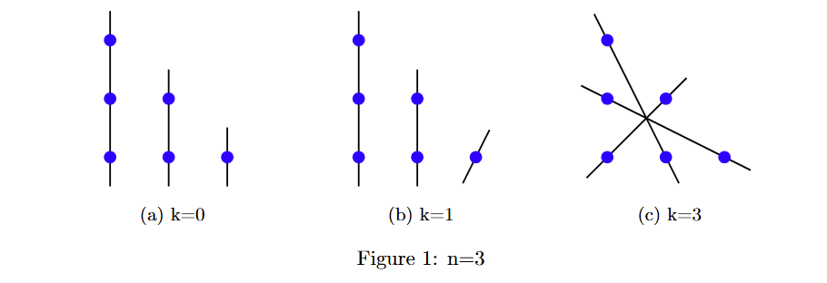
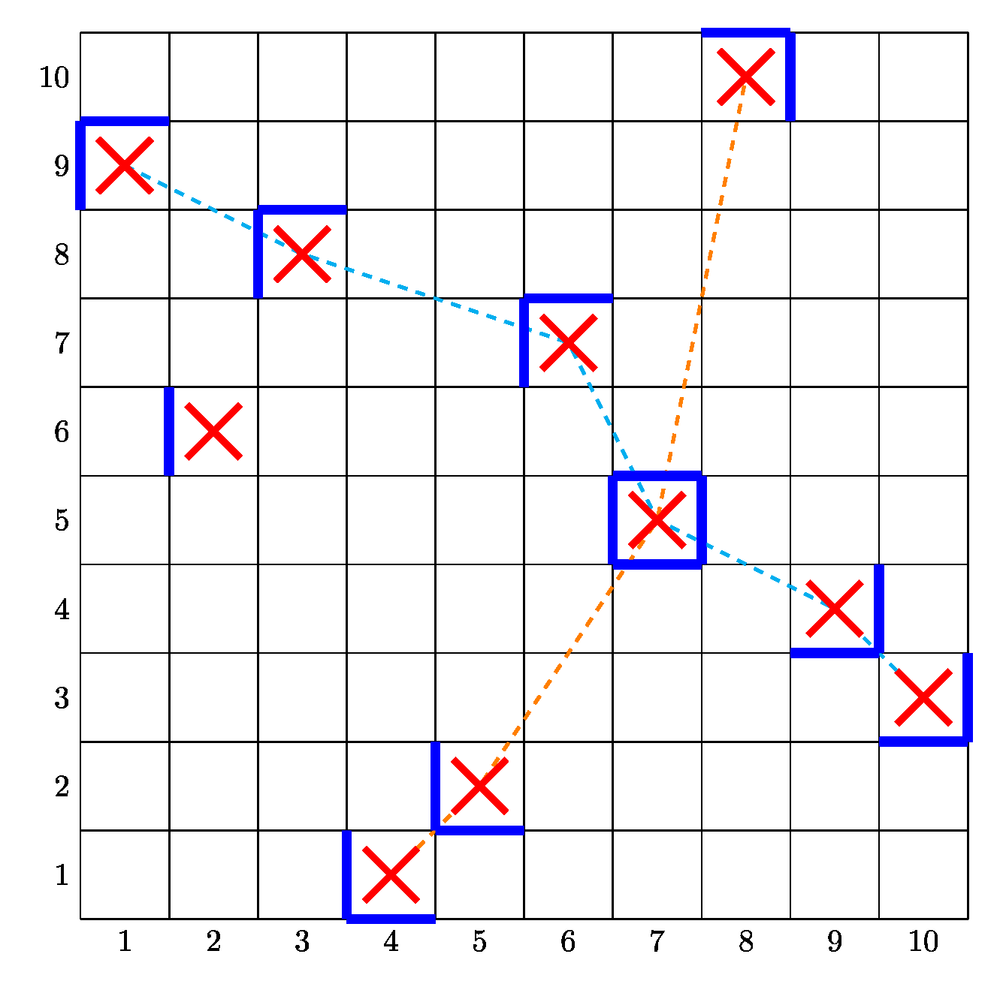

+++
author = "Shaojia"
title = "Notes on IMO 2025"
date = "2026-02-06T19:21:39+08:00"
tags = []
cover = "p1-fig1.png"
description = ""
showFullContent = false
hideComments = false
Toc = true
+++

> This post was originally posted on [my Cnblogs](https://www.cnblogs.com/shaojia/p/18988977) in summer 2025.  
> I recently felt like reviewing it again, so I decided to translate it into English and polish it a little.

**Disclaimer**: I'm not a math-specialized student and I've never actually competed in math olympiads.  
This article may contain obvious mistakes or non-rigorous steps. I only managed to solve Problems 1, 4, and 6, so these are the only ones covered here.

If you haven't seen the problems or want to refresh your memory, you can find them on the [official IMO website](https://www.imo-official.org/problems.aspx).

## Problem 1

We claim that the only possible values of \(k\) are 0, 1, and 3. We'll prove this by induction.

First, let's handle the base case (\(n=3\)).  
After enumerating all possibilities, we find that if one line is sunny, then the other two lines are either **both sunny or both not sunny**.  
So \(k \neq 2\). Figure [1](#p1-fig1) shows the constructions for the other cases.

For \(n > 3\), see Figure [2](#p1-fig2).  
If the configuration contains at least one border line (the black lines in the figure), we can reduce the problem of order \(n\) to a problem of order \(n-1\).  
Otherwise, every line can pass through at most 2 red dots. This means we need at least \(\frac{3n-3}{2}\) lines, which is greater than \(n\).

## Problem 4

We use the notation \(f_{1/2/3}(n)\) to denote the 1st, 2nd, and 3rd smallest proper divisors of the positive integer \(n\).

Define \(g(n) = \frac{1}{f_1(n)} + \frac{1}{f_2(n)} + \frac{1}{f_3(n)}\).  
Then the sequence is defined by \(a_{i+1} = a_i \cdot g(a_i)\), given some starting value \(a_1\).

Let \(\nu_p(x)\) denote the exponent of the prime \(p\) in the prime factorization of the rational number \(x\). (Note: this exponent can be negative since \(x\) can have \(p\) in the denominator.)

**Lemma 1**: Every term in the sequence \(a\) is even.

> Proof: Suppose some \(a_i\) is odd. Then \(g(a_i) < 1\), so from that point onward the sequence is strictly decreasing and consists entirely of positive odd integers, which is impossible.

**Lemma 2**: Every term in the sequence \(a\) is a multiple of 3.

> Proof: We prove by induction on \(i\).  
> From Lemma 1 we already know every \(a_i\) is even. Suppose \(a_i\) is not divisible by 3.  
> Then the three smallest proper divisors \(f_{1/2/3}(a_i)\) must be one of the following: (2,p,q), (2,p,2p), (2,4,p), or (2,4,8), where p and q are odd primes.  
> We check each case briefly:  
> - In the case of (2,p,q): \(g(a_i) = \frac{pq + 2(p+q)}{2pq}\) gives \(\nu_2(g(a_i)) = -1\), so \(a_{i+1}\) becomes odd, which is a contradiction.  
> - In the case of (2,p,2p): \(g(a_i) = \frac{p+3}{2p} < 1\) and \(\nu_3(g(a_i)) = 0\), so induction holds (since Lemma 2 already ensures \(p\ne 3\)).
> - The remaining two cases are similar: \(g(a_i) < 1\) and \(\nu_3(g(a_i)) = 0\).

**Lemma 3**: No term in the sequence \(a\) is divisible by 5.

> Proof: Again by induction on \(i\).  
> Assume \(a_i\) is divisible by 5. From Lemmas 1 and 2, \(f_{1/2/3}(a_i)\) is either (2,3,4) or (2,3,5).  
> - For (2,3,4): \(g(a_i) = \frac{13}{12}\), \(\nu_2(g(a_i)) = -2\), \(\nu_5(g(a_i)) = 0\), so induction works.  
> - For (2,3,5): \(g(a_i) = \frac{31}{30}\), \(\nu_2(g(a_i)) = -1\) gives that \(a_{i+1}\) is odd, which is a contradiction.

So far we know that every term is divisible by 2 and 3, but not by 5.  
Moreover, for any term \(x\) in the sequence, the three smallest proper divisors are either (2,3,4) or (2,3,6), corresponding to \(\nu_2(x) \ge 2\) and \(\nu_2(x) = 1\) respectively.

The last step is to track how the exponents change.  
Specifically, \(g(x) = \frac{13}{12}\) when the divisors are (2,3,4), and \(g(x) = 1\) when they are (2,3,6).

Therefore, any term with divisors (2,3,4) will repeatedly be divided by 12 and multiplied by 13 in successive steps until it reaches the form (2,3,6), at which point it stabilizes (since g = 1 thereafter).

Therefore, every possible starting value \(a_1\) must be of the form \(12^k \cdot 6 \cdot t\), where \(k \in \mathbb{N}\), \(t \in \mathbb{N}^+\), and \(t\) is not divisible by 2 or 5.

## Problem 6

> I managed to construct the optimal solution, but struggled to prove it was indeed optimal.  
> I found [this post on AoPS](https://artofproblemsolving.com/community/c6h3610487p35341804) very helpful for completing the proof.

We set \(n=45\), so the grid size is \(n^2 \times n^2 = 2025 \times 2025\) (nicely matching the year).

We treat the uncovered unit squares as a permutation: \(p_x = y\) means the square \((x,y)\) is uncovered.

By the [Erdős–Szekeres theorem](https://en.wikipedia.org/wiki/Erd%C5%91s%E2%80%93Szekeres_theorem), the product of the length of the <abbr title="Longest Increasing Subsequence">LIS</abbr> and the <abbr title="Longest Decreasing Subsequence">LDS</abbr> of the permutation \(p\) is at least \(n^2\).  
Moreover, the LIS and LDS share exactly one common element, which we call O.

We then color the sides of the uncovered squares according to their relative positions with respect to the LIS, LDS, and O (see the figure below).

The coloring is a bit tricky to describe in words (for example, O has all four sides colored, while squares not on LIS or LDS have exactly one side colored).

Notice that each side of every tile can touch at most one colored side.  
Except for at most 4 colored sides on the boundary of the grid, every colored side must be covered by some tile side.

Let the lengths of LIS and LDS be \(a\) and \(b\). We already have \(a \times b \ge n^2\).

The total number of colored sides is \(n^2 + a + b + 1\).

Therefore, the minimum number of tiles needed is at least  
\(n^2 + a + b - 3 \ge n^2 + 2n - 3 = (n+1)^2 - 4\).

The actual construction is quite beautiful (shown below).

